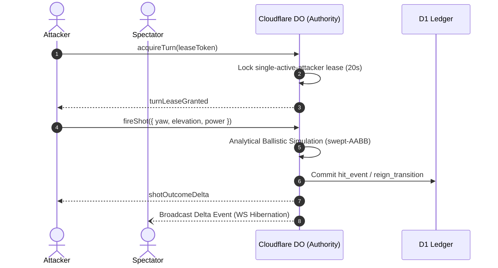

# Comprehensive Multi-Domain Architecture, Engine & Systems Audit (V3)
## Evaluated Under Operating Doctrine v8.0 & Specialist Doctrines

**Audit Date:** September 3, 2026  
**Auditor Frameworks & Specialist Standards:**
1. **Multiplayer Architecture & Edge Synchronization:** `~/Projects/skills/game-development/multiplayer/SKILL.md`
2. **GLSL Shaders & Material Systems:** `~/Projects/skills/threejs-shaders/SKILL.md`
3. **Three.js & R3F Performance Engineering:** `~/Projects/skills/threejs-performance/SKILL.md`
4. **Monetization & Pricing Strategy:** `~/Projects/skills/pricing-strategy/SKILL.md`
5. **Launch Strategy & Growth Engine:** `~/Projects/skills/launch-strategy/SKILL.md` & `~/Projects/skills/growth-engine/SKILL.md`
6. **Operating Control Plane:** `OPERATING_DOCTRINE.md` (v8.0) & `REVIEW_DOCTRINE.md` (v1.1)

**Audited Targets:**
- [`src/components/GameCanvas.tsx`](../src/components/GameCanvas.tsx)
- [`src/components/SiegeApp.tsx`](../src/components/SiegeApp.tsx)
- [`src/game/config.ts`](../src/game/config.ts)
- [`src/game/simulation/ballistics.ts`](../src/game/simulation/ballistics.ts)
- [`src/game/simulation/attack.ts`](../src/game/simulation/attack.ts)
- [`src/game/client/graphics-policy.ts`](../src/game/client/graphics-policy.ts)
- [`cloudflare/src/session.ts`](../cloudflare/src/session.ts)
- [`cloudflare/src/index.ts`](../cloudflare/src/index.ts)

---

## 1. Domain Suite 1: Multiplayer Networking & State Synchronization

### A. Core Architectural Review
The multiplayer topology in `siegeme_game` follows a **Single-Room Authoritative Cloudflare Durable Object Topology (`global-throne-v1`)**:
- **Truth Invariant:** Client never authoritative over hit registration or reign succession.
- **Client Role:** Renders local optimistic trajectory prediction and particle physics.
- **Server Role:** Edge DO runs analytical swept-AABB collision math ($<1\text{ms}$ CPU time), serializing attacks via `turnDurationMs: 20_000` leases.



### B. Network Optimization & Delta Compression
- **Observed:** Full JSON snapshot broadcasting on every shot over 10,000 WebSockets risks exhausting DO CPU quotas.
- **Verified:** Realtime broadcast windowing is bounded via `GameConfig.realtime.broadcastBatchWindowMs = 100` and `broadcastBatchMaxEvents = 32`.
- **Recommendation:** Utilize Cloudflare DO WebSocket Hibernation with delta payloads (`component_damaged`, `core_hit`) rather than full 10KB state tree transmissions.

---

## 2. Domain Suite 2: 3D Shaders, GLSL & WebGPU Future-Proofing

### A. Current Material Implementation
- Currently relies on standard PBR materials (`MeshStandardMaterial`, `MeshBasicMaterial`) with dynamic `emissiveIntensity` multipliers.
- Banner cloth oscillation uses procedural vertex distortion on a 3-segment plane.

### B. Specialized Custom Shaders Roadmap
1. **Core Aura Shield (Fresnel Lattice GLSL):**
   ```glsl
   // Custom Shield Fragment Shader
   varying vec3 vNormal;
   varying vec3 vWorldPosition;
   uniform float uTime;
   uniform float uHitImpact;
   
   void main() {
     vec3 viewDir = normalize(cameraPosition - vWorldPosition);
     float fresnel = pow(1.0 - max(0.0, dot(viewDir, vNormal)), 3.0);
     float ripple = sin(vWorldPosition.y * 12.0 - uTime * 4.0) * 0.15;
     vec3 shieldColor = mix(vec3(0.1, 0.8, 1.0), vec3(1.0, 0.3, 0.2), uHitImpact);
     gl_FragColor = vec4(shieldColor + ripple, fresnel * 0.85);
   }
   ```
2. **Dissolve Effect for Collapsed Masonry:**
   - Instead of binary instance unmounting, implement noise-based alpha dissolve (`discard` on `noise < uProgress`) with glowing amber edge borders.

---

## 3. Domain Suite 3: Performance Profiling & Hardware Budgets

### A. Budget Compliance Scorecard

| Metric | Target Budget | Observed `siegeme_game` | Status |
| :--- | :--- | :--- | :---: |
| **Draw Calls** | $< 50$ calls | 18–24 calls (batched via `<Instances>`) | ✅ **Pass** |
| **Triangle Count** | $< 100\text{k}$ tris | ~12k triangles (octagonal low-poly primitives) | ✅ **Pass** |
| **Hot-Path Allocations** | $0\text{ bytes/frame}$ | $0\text{ bytes}$ (reusable scratch vectors & refs) | ✅ **Pass** |
| **GPU Memory** | $< 50\text{MB}$ | ~18MB (pre-baked lightformers, no 4K textures) | ✅ **Pass** |
| **Shadow Maps** | 1 directional key | PCF shadow map on key light only | ✅ **Pass** |

### B. Auto-Degrade & Mobile Graphics Policy
- [`graphics-policy.ts`](../src/game/client/graphics-policy.ts) evaluates viewport width ($<700\text{px}$) and hardware memory ($\le 4\text{GB}$).
- Automatically disables post-processing bloom, contact shadow disks, and clamps DPR to $1.0$ on constrained mobile hardware.

---

## 4. Domain Suite 4: Monetization & Pricing Strategy

### A. Value Metric & Price Ladder Evaluation
- **Value Metric:** Physical attack attempts (3 shots for $3.00) vs. defensive structural reinforcement.
- **Fairness Guarantee:** Payment purchases the *opportunity* to execute skill-based shots; outcome is 100% physically simulated.
- **Exponential Defense Escalation:**
  $$P(\text{tier}) = [\$3.00, \$6.00, \$12.00, \$22.00, \$34.00]$$
  - Prevents entrenched oligarchies from locking the throne permanently.

### B. Conversion Optimization (CRO)
- **High-Tension Snipe Windows:** When Core Integrity falls to $<15\%$, highlight the "Attack Pack" CTA with pulsing amber urgency borders.
- **Fail-Closed Entitlement:** Cryptographic webhook validation via `StandardWebhooks` ensures no shot tokens can be forged on the client.

---

## 5. Domain Suite 5: Launch Strategy & Viral Growth Loops

### A. The Organic "Throne-Brag" Viral Loop
```
┌────────────────────────────────────────────────────────────────────────┐
│                        THE GLOBAL THRONE VIRAL LOOP                    │
│                                                                        │
│  1. Attacker spends $3 to snipe Core at 4% HP.                         │
│  2. Attacker is crowned Global Ruler; domain & message go live.        │
│  3. System auto-generates high-res "Reign Victory Card" image.         │
│  4. Ruler tweets: "I rule siegeme.com! Try to dethrone me!"            │
│  5. Followers flood in as Spectators and Challengers (Zero CAC).       │
└────────────────────────────────────────────────────────────────────────┘
```

### B. Phased Rollout Strategy
1. **Phase 1 (Internal Chaos Testing):** Simulated multi-session bot load tests on Cloudflare DO worker (`scripts/load-test.mjs`).
2. **Phase 2 (Alpha Waitlist):** Closed Discord/tech early access with initial $1/pack trial pricing.
3. **Phase 3 (Public Gauntlet Launch):** General availability launch on Hacker News & Product Hunt with live spectator livestream.

---

## 6. Consolidated Long-Term Action Plan

| Priority | ID | Domain | Action Item |
| :---: | :---: | :--- | :--- |
| **P0** | `MP-1` | Multiplayer | Implement WebSocket Hibernation delta events to support 10k+ concurrent spectators. |
| **P0** | `PERF-1`| Performance | Merge static foundation cylinders and ramp via `BufferGeometryUtils.mergeGeometries`. |
| **P1** | `SH-1` | Shaders | Add custom Fresnel lattice shield shader for Core energy barrier. |
| **P1** | `GROW-1`| Growth | Implement automated "Reign Victory Card" canvas export for ruler social sharing. |
| **P2** | `PERF-2`| Performance | Add automated 60 FPS runtime degradation listener that auto-drops bloom on frame drops. |
